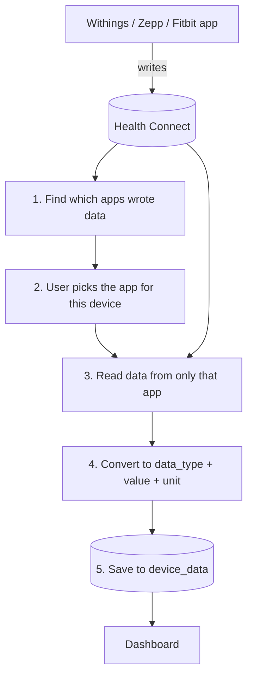

# Health Connect data flow

How readings from a wearable or smart scale end up in `device_data`.

## The constraint everything follows from

Health Connect is **one shared pool** of data from every health app on the phone. It does
**not** identify physical devices — the only attribution it exposes is
`Metadata.dataOrigin`, the package name of the *app* that wrote the record.

So each device row is bound to one source app (`devices.health_source`), and every read is
filtered by it. Two watches publishing through the same app are indistinguishable.

## The flow

## The five steps

### 1. Find which apps wrote data

Scans the last 30 days across all 30 record types **unfiltered** — the only place we read
without a filter, because discovering the apps is the point. Returns package names with a
record count each, e.g. `com.withings.wiscale2 → 412`.

- `android/app/src/main/java/com/symbiot/care/sync/HealthConnectReader.kt:195` — `dataOrigins()`
- `android/app/src/main/java/com/symbiot/care/sync/BackgroundSyncPlugin.kt:183` — 30-day window
- `src/lib/capacitor/healthConnect.ts:390` — `listHealthDataOrigins()`, the JS fallback

### 2. User picks the app for this device

That list becomes a dropdown on each device card, package names shown as friendly labels
(`com.withings.wiscale2` → "Withings Health Mate"). The choice is saved to
`devices.health_source`. A partial unique index on `(elderly_person_id, health_source)`
keeps one app per device — sharing a source is what caused double-counted readings.

- `src/components/pairing/HealthSourcePicker.tsx:27` — package → label map
- `src/components/pairing/HealthSourcePicker.tsx:91` — the save
- `supabase/migrations/20260728120000_add_health_source_to_devices.sql` — column + index

### 3. Read data from only that app

Loops all 30 record types with `dataOriginFilter` set to the device's package, skipping any
type the user declined — reading a declined type throws and would otherwise abort the batch.

- `android/app/src/main/java/com/symbiot/care/sync/HealthConnectReader.kt:159` — `read()`
- `android/app/src/main/java/com/symbiot/care/sync/HealthConnectReader.kt:71` — the 30 record types
- `src/lib/capacitor/healthConnect.ts:333` — `readRecentHealthRecords()`

### 4. Convert to `data_type` + `value` + `unit`

Each record becomes a flat row: a `data_type`, the reading as JSON, a unit and a timestamp.
Units are normalised on the way out (kg, °C, kcal, m) so a stored value never has to be
interpreted against the app that wrote it.

- `android/app/src/main/java/com/symbiot/care/sync/HealthConnectReader.kt:219` — `map()`
- `src/lib/healthMetrics.ts` — how each `data_type` is labelled and charted

### 5. Save to `device_data`

Dedupe same-key rows (Postgres rejects an `ON CONFLICT` batch touching one key twice), then
**upsert** on `(device_id, data_type, recorded_at)`. Upsert, not insert: the read window
deliberately overlaps previous syncs because source apps back-fill and revise records after
the fact.

- `src/hooks/useDeviceSync.ts:211` — foreground sync
- `android/app/src/main/java/com/symbiot/care/sync/DeviceSyncWorker.kt` — the same path on a
  periodic WorkManager job

## Two layers, one row shape

The JS Health Connect plugin models only **14** record types — it cannot request permission
for or read sleep, distance, HRV, total calories or exercise. The **native Kotlin reader is
the primary path** and covers all **30**. The JS path is a fallback and emits identical
`data_type` / `value` shapes, so its rows upsert onto the native ones rather than
duplicating them.

Keep them in sync: if you add a record type to `HealthConnectReader.kt`, mirror the
`data_type` and value shape in `src/lib/capacitor/healthConnect.ts`.

## Never break this

**`dataOrigins` must never be empty.** Health Connect reads an empty `dataOriginFilter` as
*"all apps"* — which is exactly how one device's readings get stored against another.
Guarded independently at three layers:

- `src/lib/capacitor/healthConnect.ts:338`
- `src/lib/capacitor/backgroundSync.ts:230`
- `android/app/src/main/java/com/symbiot/care/sync/HealthConnectReader.kt:161`

## Adding a new brand

No code change needed — the pipeline is keyed on source apps, not device makes. Register the
device, map it to its app in the dropdown, done. The only optional touch is adding the
package name to `KNOWN_SOURCES` in `HealthSourcePicker.tsx:27` so it shows a friendly name
instead of the raw package.

## Troubleshooting an empty sync

| Symptom | Cause |
| --- | --- |
| App missing from the dropdown | It hasn't written in 30 days (`ORIGIN_DISCOVERY_DAYS`), or the list is still cached — the query has a 5 min `staleTime` |
| Dropdown empty entirely | No Health Connect read permissions granted to Symbiot Care |
| Sync reports "no new readings" | Right app, but nothing written since the last watermark — or the wrong app is mapped |
| Health Connect sync button disabled | `devices.health_source` is null; the device isn't mapped yet |
